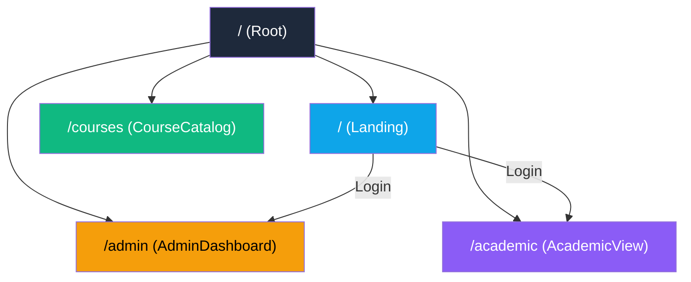

# 📊 OptiSched Frontend — Proje Analiz Raporu

## 🏗️ Genel Bakış

**OptiSched**, bir üniversite ders programı optimizasyon (ERP) sistemidir. Frontend tarafı **React + TypeScript + Vite** üzerine kurulmuş, **Tailwind CSS v4** ile stillendiriliyor.

---

## ⚙️ Teknoloji Yığını

| Kategori | Teknoloji | Versiyon |
|---|---|---|
| **Framework** | React | 18.3.x |
| **Dil** | TypeScript | 5.4.x |
| **Bundler** | Vite | 6.4.x |
| **CSS** | Tailwind CSS | 4.1.x |
| **Router** | React Router | 7.13.x |
| **UI Kütüphaneleri** | Radix UI, MUI, Lucide Icons | Çeşitli |
| **Animasyon** | Motion (Framer Motion) | 12.x |
| **Grafikler** | Recharts | 2.15.x |
| **DnD** | react-dnd | 16.x |
| **Form** | react-hook-form | 7.55.x |
| **Toast** | Sonner | 2.x |

---

## 📁 Proje Yapısı

```
optisched-frontend/
├── index.html                    # SPA giriş noktası
├── vite.config.ts                # Vite yapılandırması (@, Tailwind, Cloudflare host)
├── package.json                  # Bağımlılıklar
├── tsconfig.json                 # TypeScript yapılandırması
│
├── public/                       # Statik dosyalar (sadece vite.svg)
│
└── src/
    ├── main.tsx                  # React mount noktası
    ├── styles/
    │   ├── index.css             # Ana stil dosyası
    │   ├── tailwind.css          # Tailwind base import
    │   ├── theme.css             # Tema değişkenleri (dark/light)
    │   ├── fonts.css             # Font tanımları
    │   └── CourseDataTable.css   # Tablo özel stilleri
    │
    └── app/
        ├── App.tsx               # Router sağlayıcısı
        ├── routes.ts             # Rota tanımları
        │
        ├── pages/                # 📄 Sayfa bileşenleri
        │   ├── Root.tsx          # Layout shell (Header + Outlet)
        │   ├── Landing.tsx       # Ana sayfa / giriş ekranı
        │   ├── AdminDashboard.tsx # Yönetici paneli
        │   ├── AcademicView.tsx  # Akademisyen görünümü
        │   └── CourseCatalog.tsx # Ders kataloğu
        │
        ├── components/           # 🧩 UI bileşenleri
        │   ├── Header.tsx        # Üst menü / navigasyon
        │   ├── LoginScreen.tsx   # Giriş formu
        │   ├── WeeklyGrid.tsx    # Haftalık ders programı grid'i (26KB!)
        │   ├── CourseDataTable.tsx# Ders verisi tablosu
        │   ├── CourseDetailModal.tsx   # Ders detay modalı
        │   ├── CourseManagementModal.tsx # Ders yönetim modalı
        │   ├── DynamicFilters.tsx     # Filtreleme paneli
        │   └── StatusPanel.tsx        # Algoritma durum paneli
        │
        ├── context/
        │   └── AppContext.tsx    # Global state yönetimi (React Context)
        │
        ├── modules/
        │   └── schedulerEngine.ts # Ders programı optimizasyon algoritması
        │
        ├── services/
        │   └── courseService.ts  # API servis katmanı
        │
        ├── hooks/
        │   ├── useCourseData.ts  # Ders verisi hook'u
        │   └── useCourseFilters.ts # Filtre mantığı hook'u
        │
        ├── types/
        │   └── courseTypes.ts    # DbCourse tip tanımı
        │
        ├── data/                 # 📦 Mock veriler
        │   ├── algorithmData.ts  # Algoritma giriş verileri
        │   ├── courseCatalogMockData.ts # Ders kataloğu (200KB!)
        │   ├── mockAccounts.ts   # Test hesapları
        │   └── mockData.ts       # Genel mock veriler
        │
        └── utils/                # (Boş — kullanılmıyor)
```

---

## 🔀 Sayfa Akışı & Routing



**Root Layout:** `AppProvider` → `Header` → `<Outlet />`

---

## 🏛️ Mimari Analiz

### State Yönetimi
- **Tek bir React Context** (`AppContext`) tüm global state'i yönetiyor
- Dark mode, auth, filtreler, seçili ders, algoritma durumu, zamanlanmış dersler hepsi burada
- `localStorage` ile dark mode ve kullanıcı oturumu persist ediliyor

### Auth Sistemi
- Mock hesaplar üzerinden çalışan basit login sistemi (`mockAccounts.ts`)
- `localStorage` ile oturum kalıcılığı
- Backend entegrasyonu henüz yok

### Scheduler (Algoritma) Engine
- `schedulerEngine.ts` içinde **client-side** çalışan ders programı optimizasyon algoritması
- Dönem seçimi (Güz/Bahar) desteği
- Çakışma kontrolü, derslik atama, istatistik çıktısı

---

## ✅ Güçlü Yönler

| # | Nokta |
|---|---|
| 1 | **Temiz dosya yapısı** — pages, components, context, hooks, services, types ayrımı doğru |
| 2 | **TypeScript** kullanımı tip güvenliği sağlıyor |
| 3 | **Tailwind v4** ile modern, utility-first CSS |
| 4 | **Dark mode** desteği mevcut |
| 5 | **Modüler bileşenler** — WeeklyGrid, CourseDataTable, DynamicFilters ayrı |
| 6 | **Custom hooks** ile data fetching ve filtre mantığı ayrışmış |
| 7 | **Algoritma motoru** frontend'de çalışır durumda |
| 8 | **Path alias** (`@/`) yapılandırılmış |

---

## ⚠️ İyileştirme Önerileri

### 🔴 Yüksek Öncelik

| # | Sorun | Detay |
|---|---|---|
| 1 | **Dev-only dosyalar kök dizinde** | `cloudflared.exe` (65MB!), `hesap_listesi.txt`, `temp_*.json/txt`, `algo_full_data.txt`, `analyze_ui.cjs` — bunlar `.gitignore`'a eklenmeli veya silinmeli |
| 2 | **Backend bağımlılıkları frontend'de** | `express`, `body-parser`, `cors` paketleri frontend projesinde. Bunlar ayrı bir backend projesine taşınmalı |
| 3 | **200KB mock veri dosyası** | `courseCatalogMockData.ts` çok büyük — lazy load veya API'den çekilmeli |
| 4 | **Tek bir devasa Context** | `AppContext` çok büyümüş (210 satır, 20+ state). Parçalanmalı (AuthContext, ScheduleContext, FilterContext) |
| 5 | **`console.log("WORKING")`** App.tsx'in başında — temizlenmeli |

### 🟡 Orta Öncelik

| # | Sorun | Detay |
|---|---|---|
| 6 | **WeeklyGrid.tsx 26KB** | Çok büyük tek bileşen — alt bileşenlere parçalanmalı |
| 7 | **`utils/` klasörü boş** | Kullanılmıyorsa silinmeli |
| 8 | **`next-themes` paketi yüklü** | Ama Vite projesi — gereksiz bağımlılık |
| 9 | **SEO eksik** | `index.html`'de meta description, favicon, Open Graph tag'leri yok |
| 10 | **Test altyapısı yok** | Hiç test dosyası veya test framework'ü bulunmuyor |

### 🟢 Düşük Öncelik

| # | Sorun | Detay |
|---|---|---|
| 11 | **`dist/` klasörü git'te** | Build çıktısı `.gitignore`'a eklenmeli |
| 12 | **Error boundary yok** | Beklenmeyen hatalar için bir ErrorBoundary bileşeni eklenmeli |
| 13 | **Loading states** | Suspense/lazy loading kullanılmıyor |
| 14 | **Accessibility** | ARIA etiketleri ve klavye navigasyonu kontrol edilmeli |

---

## 📈 Boyut İstatistikleri

| Metrik | Değer |
|---|---|
| **Toplam sayfa** | 5 (Root, Landing, Admin, Academic, CourseCatalog) |
| **Toplam bileşen** | 8 |
| **Toplam hook** | 2 |
| **En büyük bileşen** | WeeklyGrid.tsx (26KB) |
| **En büyük veri dosyası** | courseCatalogMockData.ts (200KB) |
| **Bağımlılık sayısı** | ~40 (production) + 7 (dev) |

---

> [!TIP]
> Proje iyi bir temele sahip. En kritik adımlar: **gereksiz dosyaların temizlenmesi**, **AppContext'in parçalanması** ve **backend bağımlılıklarının ayrılması** olacaktır. Bunlar üzerinde çalışmamı ister misin?
