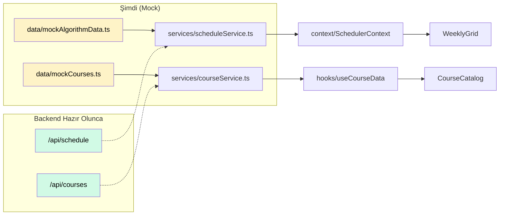

# 🔧 OptiSched Frontend — Detaylı Teknik İyileştirme Planı

---

## 1. AppContext Neden Şişmiş ve Nasıl Bölünmeli?

### Mevcut Durum

[AppContext.tsx](file:///c:/Users/soyda/optisched-frontend/src/app/context/AppContext.tsx) şu anda **210 satır**, **20+ state değişkeni** ve **birbirinden tamamen bağımsız 5 sorumluluk alanını** tek dosyada yönetiyor:

| # | Sorumluluk | State Sayısı | Satır Aralığı |
|---|---|---|---|
| 1 | **Tema** (dark mode) | 1 state + 1 effect + 1 callback | L62–L65, L144–L153 |
| 2 | **Auth** (login/logout) | 1 state + 2 callback | L67–L85 |
| 3 | **Filtreler** | 1 state + 2 callback | L86, L155–L162 |
| 4 | **UI State** (selected course, modals, accordion) | 4 state + 1 callback | L87–L90, L114, L164–L170 |
| 5 | **Scheduler/Algoritma** | 7 state + 3 callback | L91–L142 |

### Neden Sorunlu?

1. **Her state değişikliğinde TÜM consumer'lar re-render oluyor.** Dark mode toggle edildiğinde bile algoritma state'inin consumer'ları re-render alıyor.
2. **Test edilemez.** Tek bir parçayı test etmek için tüm context'i mock'lamak gerekiyor.
3. **Okunabilirlik düşük.** Yeni geliştirici dosyayı açtığında 5 farklı domain'i aynı anda anlamaya çalışıyor.

### Önerilen Yapı — 4 Ayrı Context

```
src/app/context/
├── ThemeContext.tsx          # darkMode, toggleDarkMode
├── AuthContext.tsx           # currentUser, login, logout
├── SchedulerContext.tsx      # algorithmCourses, scheduledCourses, scheduleStats,
│                             # selectedTerm, selectedLecturer, isCalculating,
│                             # calculationTime, runAlgorithm, updateCourseSection,
│                             # updateCourseContext
├── UIContext.tsx             # filters, setFilter, resetFilters,
│                             # selectedCourse, setSelectedCourse,
│                             # openCourseIds, toggleCourseOpen,
│                             # publishedAt, setPublishedAt,
│                             # isManageModalOpen, setIsManageModalOpen
└── AppProvider.tsx           # Hepsini sarmalayan compose provider
```

#### Provider Compose Örneği

```tsx
// AppProvider.tsx
export function AppProvider({ children }) {
  return (
    <ThemeProvider>
      <AuthProvider>
        <SchedulerProvider>
          <UIProvider>
            {children}
          </UIProvider>
        </SchedulerProvider>
      </AuthProvider>
    </ThemeProvider>
  );
}
```

#### Bileşenlerde Kullanım

```tsx
// Öncesi (tüm state'i çekiyor):
const { darkMode, filters, scheduledCourses, currentUser } = useApp();

// Sonrası (sadece ihtiyaç olan state):
const { darkMode } = useTheme();
const { filters } = useUI();
const { scheduledCourses } = useScheduler();
```

> [!TIP]
> Bu ayrım yapılırken `useApp()` hook'u geçici olarak korunup, yeni hook'ları delegasyon ile çağırabilir. Böylece mevcut tüm importları hemen değiştirmek zorunda kalmazsın.

---

## 2. WeeklyGrid.tsx Nasıl Parçalanmalı?

### Mevcut Durum

[WeeklyGrid.tsx](file:///c:/Users/soyda/optisched-frontend/src/app/components/WeeklyGrid.tsx) — **653 satır, 26KB**, aşağıdaki sorumluluklar tek dosyada:

| Satır Aralığı | Ne Yapıyor | Boyut |
|---|---|---|
| L16–L29 | Time helpers (`toMinutes`, `getTop`, `getHeight`) | ~15 satır |
| L31–L77 | Overlap layout engine (Union-Find algoritması) | ~47 satır |
| L80–L84 | Time label generation | ~5 satır |
| L103–L116 | `useCurrentMinute` custom hook | ~14 satır |
| L122–L411 | **Ana WeeklyGrid bileşeni** | ~290 satır |
| L417–L542 | **TooltipContent** alt bileşeni | ~125 satır |
| L548–L653 | **CourseCard** alt bileşeni | ~105 satır |

### Önerilen Parçalama

```
src/app/components/weekly-grid/
├── index.ts                    # export { WeeklyGrid } from './WeeklyGrid'
├── WeeklyGrid.tsx              # Ana grid bileşeni (~150 satır)
├── DayColumn.tsx               # Gün sütunu (zebra, grid lines, course cards) (~80 satır)
├── TimeGutter.tsx              # Sol taraftaki saat gutter'ı (~40 satır)
├── DayHeader.tsx               # Üst satırdaki gün başlıkları (~40 satır)
├── CourseCard.tsx              # Ders kartı bileşeni (~105 satır, olduğu gibi)
├── CourseTooltip.tsx           # Tooltip portal + içerik (~125 satır, olduğu gibi)
├── CurrentTimeIndicator.tsx   # Kırmızı "şu anki saat" çizgisi (~25 satır)
├── constants.ts                # SLOT_HEIGHT, START_HOUR, END_HOUR, TIME_LABELS
├── types.ts                    # LayoutCourse, HoveredState, TooltipPlacement
├── utils.ts                    # toMinutes, getTop, getHeight
└── useOverlapLayout.ts        # layoutDayCourses (Union-Find) + useCurrentMinute
```

### Parçalama Detayları

#### `constants.ts`
```typescript
export const SLOT_HEIGHT = 50;
export const START_HOUR = 9;
export const END_HOUR = 17;
export const TOTAL_SLOTS = (END_HOUR - START_HOUR) * 2;
export const GRID_PADDING_TOP = 16;
export const TOOLTIP_WIDTH = 280;
export const TIME_LABELS: string[] = [...];
```

#### `utils.ts`
```typescript
export function toMinutes(time: string): number { ... }
export function getTop(startTime: string): number { ... }
export function getHeight(startTime: string, endTime: string): number { ... }
```

#### `useOverlapLayout.ts`
Union-Find algoritması (`layoutDayCourses`) ve `useCurrentMinute` hook'u buraya taşınır. Bu mantık tamamen görsel layout ile ilgili olduğu için component'lerden ayrılmalı.

#### `DayColumn.tsx`
WeeklyGrid'in `{DAYS.map((day, dayIdx) => ...)}` içindeki tüm render (L311–L385) bu bileşene çıkartılır:
- Zebra stripe'lar
- Grid çizgileri
- `CurrentTimeIndicator`
- Course card listesi

Bu çıkarımla **ana WeeklyGrid ~150 satıra** düşer.

> [!IMPORTANT]
> `CourseCard` ve `TooltipContent` zaten ayrı fonksiyonlar olarak tanımlı — dosya ayırmak minimum riskli bir operasyon. Import path'leri değişecek ama mantık aynı kalacak.

---

## 3. package.json — Gereksiz Paketler

[package.json](file:///c:/Users/soyda/optisched-frontend/src/app/../../../package.json) incelendiğinde:

### 🔴 Kesinlikle Gereksiz (Frontend'de İşi Olmayan)

| Paket | Neden | Boyut Etkisi |
|---|---|---|
| `express` | Backend framework'ü. Frontend projesinde çalışmıyor | ~2MB |
| `body-parser` | Express middleware. Frontend'de kullanılamaz | ~200KB |
| `cors` | Express middleware. Frontend'de kullanılamaz | ~50KB |

> Bu 3 paket muhtemelen eski bir denemeden kalmış. Codebase'de hiçbir yerde import edilmiyor.

### 🟡 Şüpheli (Kullanılıp Kullanılmadığı Kontrol Edilmeli)

| Paket | Durum |
|---|---|
| `next-themes` | Next.js'e özel tema paketi. Vite projesinde çalışmaz. Dark mode `AppContext` içinde zaten localStorage ile yönetiliyor — **gereksiz** |
| `react-popper` + `@popperjs/core` | Tooltip/popover pozisyonlama. Ancak WeeklyGrid'deki tooltip **kendi pozisyon hesaplamasını yapıyor** (L164–L194). Radix UI'ın popover'ı da kendi pozisyonlamasını yapıyor — **büyük ihtimalle gereksiz** |
| `react-slick` | Carousel kütüphanesi. `embla-carousel-react` zaten yüklü. İki carousel kütüphanesi birden — **birini sil** |
| `react-responsive-masonry` | Masonry layout. Projede kullanıldığını göremedim — **kontrol et** |

### ✅ Kullanılıyor, Kalmalı

| Paket | Kullanım |
|---|---|
| `react-router` | Routing (routes.ts) |
| `lucide-react` | İkonlar (her yerde) |
| `motion` | Animasyonlar |
| `react-dnd` + `react-dnd-html5-backend` | Drag & drop (CourseManagementModal) |
| `react-hook-form` | Form yönetimi |
| `sonner` | Toast bildirimleri |
| `recharts` | Grafikler |
| Radix UI paketleri | UI primitives |
| `class-variance-authority` + `clsx` + `tailwind-merge` | CSS utility'leri |
| `cmdk` | Command palette |
| `date-fns` | Tarih formatting |
| `vaul` | Drawer component |

### Tahmini Temizlik Etkisi

```
Silinecek paketler: express, body-parser, cors, next-themes,
                    react-popper, @popperjs/core, react-slick,
                    (muhtemelen) react-responsive-masonry

Tahmini node_modules küçülme: ~5-8MB
Tahmini bundle küçülme: ~0 (tree-shaking zaten yapıyor, ama temiz kalmak önemli)
```

---

## 4. Dokunulmaması Gerekenler

> [!CAUTION]
> Aşağıdaki dosyalar kullanıcı tarafından **korunacak** olarak işaretlenmiştir. Hiçbir iyileştirme adımında bunlara dokunma.

| Dosya | Neden Korunuyor |
|---|---|
| `cloudflared.exe` (65MB) | Tunnel erişimi için kullanılıyor |
| `cloudflared_tunnel.log` | Tunnel log'ları |
| `tunnel_output.txt` | Tunnel çıktısı |
| `hesap_listesi.txt` | Hesap bilgileri |
| `algo_full_data.txt` | Algoritma referans verisi |
| `temp_cleanup_results.json` | Önceki cleanup sonuçları |
| `temp_file_list_xxx.txt` | Dosya listesi |
| `analyze_ui.cjs` | UI analiz scripti |

> [!TIP]
> Bu dosyaların `.gitignore`'a eklenmesi ayrıca değerlendirilebilir (kod değişikliği değil, git config değişikliği).

---

## 5. Test Altyapısı — Minimum Gereksinimler

### Paketler

```json
{
  "devDependencies": {
    "vitest": "^3.x",                        // Test runner (Vite native)
    "@testing-library/react": "^16.x",        // React component testing
    "@testing-library/jest-dom": "^6.x",      // DOM assertion matchers
    "@testing-library/user-event": "^14.x",   // Kullanıcı etkileşim simülasyonu
    "jsdom": "^25.x"                          // Browser-like DOM environment
  }
}
```

### Yapılandırma Dosyaları

#### `vite.config.ts` — test bloğu eklenmesi
```typescript
export default defineConfig({
  // ... mevcut config
  test: {
    globals: true,
    environment: 'jsdom',
    setupFiles: './src/test/setup.ts',
    css: true,
  },
});
```

#### `src/test/setup.ts`
```typescript
import '@testing-library/jest-dom';
```

#### `package.json` — script eklenmesi
```json
{
  "scripts": {
    "test": "vitest",
    "test:run": "vitest run",
    "test:coverage": "vitest run --coverage"
  }
}
```

### Önerilen İlk Test Dosyaları (Öncelik Sırasına Göre)

| Dosya | Ne Test Edilir | Neden Öncelikli |
|---|---|---|
| `schedulerEngine.test.ts` | `runScheduler()`, `canPlace()`, `splitHours()` | Saf fonksiyonlar, DOM'a bağımlı değil, kritik iş mantığı |
| `mockAccounts.test.ts` | `generateUsername()`, `slugify()` | Saf fonksiyon, kolay test |
| `useCourseFilters.test.ts` | `filterCourses()` mantığı | Filtreleme doğruluğu kritik |
| `WeeklyGrid/utils.test.ts` | `toMinutes()`, `getTop()`, `getHeight()`, `layoutDayCourses()` | Saf hesaplama fonksiyonları |
| `LoginScreen.test.tsx` | Login form render, submit, hata mesajı | İlk component testi |

### Dosya Yapısı

```
src/
├── test/
│   └── setup.ts
└── app/
    ├── modules/
    │   ├── schedulerEngine.ts
    │   └── __tests__/
    │       └── schedulerEngine.test.ts
    ├── components/
    │   └── __tests__/
    │       └── LoginScreen.test.tsx
    └── hooks/
        └── __tests__/
            └── useCourseFilters.test.ts
```

> [!TIP]
> `vitest` tercih sebebi: Vite ile native entegrasyon, sıfır konfigürasyon, Jest-compatible API, ve HMR ile anında test çalıştırma.

---

## 6. Frontend Mimari: Servis & Mock Data Ayrımı

### Mevcut Sorunlar

1. **İki farklı veri akışı var, birbirinden habersiz:**
   - `courseService.ts` → `useCourseData` hook → `CourseCatalog` sayfası (DbCourse tipi)
   - `algorithmData.ts` → `AppContext` → `schedulerEngine` → `WeeklyGrid` (AlgorithmInput + Course tipi)

2. **3 farklı "Course" tipi var:**
   - `Course` (mockData.ts) — grid/UI modeli
   - `DbCourse` (courseTypes.ts) — veritabanı modeli
   - `AlgorithmInput` (algorithmData.ts) — algoritma giriş modeli

3. **`courseService.ts` sadece CourseCatalog'da kullanılıyor.** Scheduler engine doğrudan static data importu yapıyor.

### Önerilen Mimari

```
src/app/
├── types/
│   ├── course.ts            # Tüm Course tipleri burada
│   │   ├── Course           # UI/grid modeli (mevcut)
│   │   ├── DbCourse         # DB modeli (mevcut)
│   │   └── AlgorithmInput   # Algoritma input modeli (algorithmData'dan taşınır)
│   └── account.ts           # Account, UserRole
│
├── services/                # API abstraction layer
│   ├── courseService.ts     # fetchCourses(): DbCourse[]
│   ├── scheduleService.ts  # [YENİ] runSchedule(courses, term): SchedulerResult
│   └── authService.ts      # [YENİ] login(id, pass): Account | null
│
├── data/                    # SADECE mock data (backend hazır olunca silinecek)
│   ├── mockCourses.ts       # courseCatalogMockData.ts → isim değişikliği
│   ├── mockAccounts.ts      # Mevcut
│   └── mockAlgorithmData.ts # algorithmData.ts → isim değişikliği
│
├── modules/
│   └── schedulerEngine.ts   # Saf algoritma, herhangi bir data import'u YOK
│                             # Sadece tip import'u var, data dışarıdan geçilir
```

### Anahtar Prensipler

#### 1. Service Layer = Tek Değişim Noktası
```typescript
// scheduleService.ts
import { runScheduler } from '../modules/schedulerEngine';
import { ALGORITHM_COURSES } from '../data/mockAlgorithmData';

export async function generateSchedule(term: TermType): Promise<SchedulerResult> {
  // ŞİMDİ: Local engine
  return runScheduler(ALGORITHM_COURSES, term);

  // BACKEND HAZIR OLUNCA:
  // const res = await fetch(`/api/schedule?term=${term}`);
  // return res.json();
}
```

#### 2. Scheduler Engine = Pure Function
```typescript
// schedulerEngine.ts — HİÇBİR data import'u yok
import type { AlgorithmInput } from '../types/course';

export function runScheduler(courses: AlgorithmInput[], term: TermType): SchedulerResult {
  // ... saf hesaplama
}
```

#### 3. Mock Data Dosyaları — Açık İsimlendirme
- `mockCourses.ts` → "Bu mock datadır" mesajı net
- Backend gelince bu klasör silinir, `services/` içindeki `fetch()` açılır

### Veri Akışı Diyagramı



---

## 📋 Önceliklendirme Özeti

### 🔴 Öncelik 1: Hemen Yapılmalı

| # | İş | Tahmini Süre | Etki |
|---|---|---|---|
| 1.1 | `App.tsx`'teki `console.log("WORKING")` satırını sil | 1 dakika | Temizlik |
| 1.2 | `express`, `body-parser`, `cors` paketlerini kaldır | 5 dakika | ~2.5MB gereksiz bağımlılık |
| 1.3 | `next-themes` paketini kaldır | 2 dakika | Kullanılmayan bağımlılık |
| 1.4 | `react-popper` + `@popperjs/core` kullanımını kontrol et, gereksizse sil | 10 dakika | Temizlik |
| 1.5 | `react-slick` veya `embla-carousel-react` — birini sil (hangisi kullanılıyorsa diğeri) | 10 dakika | Duplicate bağımlılık |

### 🟡 Öncelik 2: Sonra Yapılmalı

| # | İş | Tahmini Süre | Etki |
|---|---|---|---|
| 2.1 | **AppContext'i 4 parçaya böl** (Theme, Auth, Scheduler, UI) | 2-3 saat | Performance, okunabilirlik, test edilebilirlik |
| 2.2 | **WeeklyGrid'i alt bileşenlere ayır** (weekly-grid/ klasörü) | 1.5-2 saat | Okunabilirlik, bakım kolaylığı |
| 2.3 | **Service layer'ı düzelt** (scheduleService, authService ekle) | 1-1.5 saat | Backend geçiş hazırlığı |
| 2.4 | **Tip birleştirme** (AlgorithmInput'u types/ altına taşı) | 30 dakika | Tutarlılık |
| 2.5 | **Test altyapısı kur** (vitest + testing-library) | 30 dakika | Kalite güvencesi temeli |
| 2.6 | **İlk testleri yaz** (schedulerEngine, utils, generateUsername) | 1-2 saat | Kritik fonksiyonların doğrulanması |
| 2.7 | **`utils/` klasörünü temizle** (ya doldur ya sil) | 5 dakika | Yapı tutarlılığı |

### ⚠️ Riskli İşler

| # | İş | Risk | Mitigasyon |
|---|---|---|---|
| R1 | **AppContext bölme** | Tüm bileşenlerdeki `useApp()` importları değişecek. Yanlış context kullanımı runtime hatası verir | Geçiş süreci için eski `useApp()` hook'unu adapter olarak koru; yeni hook'ları delegasyon yapsın |
| R2 | **WeeklyGrid parçalama** | Tooltip pozisyon hesaplaması parent-child ref iletişimine bağımlı. Yanlış parçalama tooltip'i bozabilir | `handleCourseHover` ve `containerRef`'i WeeklyGrid'de tut, child'lara prop olarak geçir |
| R3 | **Paket silme** | `react-slick` veya `react-responsive-masonry` beklenmedik bir yerde import ediliyorsa build kırılır | Silmeden önce `grep -r "react-slick"` ve `grep -r "react-responsive-masonry"` çalıştır |
| R4 | **Service layer değişikliği** | `schedulerEngine.ts`'in doğrudan `mockData`'dan import ettiği `COURSE_COLORS`, `DAYS` gibi sabitler var | `COURSE_COLORS` ve `DAYS`'i `constants.ts`'e taşı, hem engine hem UI oradan import etsin |

### 🚫 Kesinlikle Dokunma

| Dosya/Alan | Neden |
|---|---|
| `cloudflared.exe`, `*_tunnel*`, `tunnel_output.txt` | Kullanıcı koruması altında |
| `hesap_listesi.txt` | Kullanıcı koruması altında |
| `algo_full_data.txt` | Kullanıcı koruması altında |
| `temp_cleanup_results.json`, `temp_file_list_xxx.txt` | Kullanıcı koruması altında |
| `analyze_ui.cjs` | Kullanıcı koruması altında |
| `schedulerEngine.ts` iç algoritma mantığı | Çalışan algoritma. Sadece import/export arayüzü değişebilir, iç mantık dokunulmaz |
| `courseCatalogMockData.ts` içeriği | 200KB veri, içeriğine dokunma; sadece dosya adı/konumu değişebilir |
| `mockAccounts.ts` iş mantığı | `generateUsername()` ve hesap yapısı çalışıyor, mantığa dokunma |

---

> [!IMPORTANT]
> Bu plan sadece okuma ve analiz içerir — **hiçbir dosya değiştirilmemiştir**. Onay verdiğin kısımları sırayla uygulamaya başlayabilirim.
